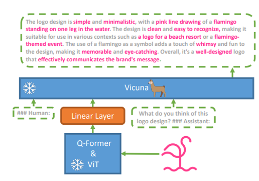
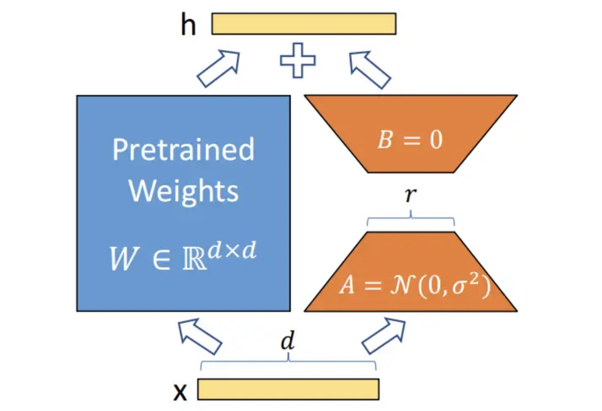

### 实验报告框架

#### 1. 研究内容与任务挑战
1.1 **研究背景与意义**  
- 多模态大模型在视觉推理任务中的重要性 
近年来，人工智能领域在多模态学习与大模型技术方面取得了显著进展。多模态大模型通过整合视觉与语言模态的信息，能够完成复杂的跨模态推理任务（如视觉问答、图像描述生成等），展现出接近人类水平的理解与生成能力。这类模型的核心在于利用大规模预训练学习通用表征，再通过下游任务微调适配具体场景。其中，**视觉推理任务**（如基于图像的问答、目标关系推理等）对模型的跨模态对齐能力、逻辑推理能力以及知识泛化能力提出了极高要求，成为验证多模态模型性能的重要基准。  
- 指令微调对模型性能的影响  
指令微调（Instruction Tuning）作为大模型适配下游任务的关键技术，通过将任务描述以自然语言指令的形式注入训练过程，显著提升了模型的零样本和小样本泛化能力。例如，FLAN、InstructGPT等工作的成功证明了指令微调对模型理解复杂任务意图、遵循多样化指令的重要性。然而，当前研究多集中于纯文本模态，**多模态场景下的指令微调如何影响视觉推理性能**仍存在探索空间，尤其是模型对视觉-语言联合指令的敏感性与适应性机制尚不明确。  
- 选择MiniGPT-4和OK-VQA任务的动机  
本研究选择**MiniGPT-4**作为基础模型，主要基于以下动机：  
1. **高效性与可扩展性**：MiniGPT-4作为轻量级多模态大模型，通过冻结视觉编码器与语言模型的策略，在保持高性能的同时大幅降低计算成本，为研究指令微调对模型各组件的影响提供了可控的实验环境。  
2. **开源生态支持**：其开放的代码与数据便于复现和对比实验，有助于深入分析指令设计对性能的贡献。  

选择**OK-VQA（Outside Knowledge VQA）任务**作为评估基准，则因其独特的挑战性：  
1. **知识依赖型推理**：OK-VQA要求模型结合图像内容与外部知识（如常识、科学事实）进行推理，而非仅依赖图像显式信息，这对多模态模型的知识融合能力提出了更高要求。  
2. **指令多样性**：该任务的问题形式多样（如“为什么”“如何解释”），为研究不同指令模板对微调效果的影响提供了丰富场景。 
- 研究意义
    - **理论层面**：揭示多模态指令微调中视觉与语言模态的协同机制，为优化模型推理路径提供依据。  
    - **应用层面**：通过轻量化模型在复杂任务中的性能提升，推动多模态技术在智能助理、教育等低资源场景的落地。

1.2 **任务挑战**  
- **模态对齐**：视觉与语言特征的融合  
    - **特征粒度不匹配**：视觉编码器（如ViT）提取的局部/全局图像特征可能与语言模型（如LLM）的语义空间存在偏差，导致跨模态交互时信息丢失。  
    - **动态交互不足**：传统的简单特征拼接或注意力机制可能无法充分建模视觉与语言之间的复杂依赖关系（如空间关系推理、属性关联等）。  
    - **知识嵌入冲突**：当外部知识（如常识库）引入时，模型需协调图像证据与知识库信息，避免生成矛盾答案。 
- **指令泛化性**：微调数据与下游任务的分布差异  
    - **分布偏移（Distribution Shift）**：微调数据（如人工构造的指令-答案对）与真实下游任务（如OK-VQA的开放域问题）可能存在语义或风格差异，导致模型过拟合微调数据而泛化能力下降。  
    - **多模态指令的复杂性**：纯文本指令微调（如Alpaca）的模板难以直接迁移到视觉-语言任务，需设计兼顾图像描述与问题语义的联合指令格式（如“基于这张图像回答问题：<Question>”）。  
    - **低资源适应性**：在标注成本较高的多模态场景下，如何通过少量指令样本激发模型的零样本能力仍需探索。  
- **计算资源限制**：显存不足时的高效微调策略（如LoRA）  
    - **显存瓶颈**：MiniGPT-4虽采用冻结部分组件的策略，但引入可训练参数（如适配器、LoRA）时仍需优化显存占用，避免因资源不足限制批量大小或序列长度。  
    - **高效微调技术选择**：  
        - **LoRA（Low-Rank Adaptation）**：通过低秩矩阵分解减少可训练参数量，但需平衡秩的选择对模态融合效果的影响。  
        - **梯度检查点（Gradient Checkpointing）**：以时间换空间，但可能延长训练周期。  
        - **混合精度训练**：需处理视觉与语言模型数值精度不一致带来的稳定性问题。  
- **答案生成控制**：模型倾向于生成完整句子而非短语（需后处理优化）  
    - **解码策略冲突**：LLM的生成偏好（基于概率的自回归采样）与任务需求（关键词提取）不匹配，需调整温度参数（Temperature）或Top-k采样。  
    - **后处理优化需求**：需设计规则或轻量模型（如分类器）从生成文本中提取关键短语，可能引入额外误差。  
    - **训练目标偏差**：传统的最大似然损失（MLE）可能无法直接约束生成格式，需探索强化学习（RL）或对比学习优化生成倾向。 


#### 2. 方法与技术细节
2.1 **模型架构**  
- MiniGPT-4整体框架图
MiniGPT-4 是一个轻量级多模态模型，通过预训练的视觉编码器（如 BLIP-2 ViT）提取图像特征，并利用线性投影层将其对齐到 Vicuna 语言模型的嵌入空间，实现图像与文本交互。它采用两阶段训练：先在大规模图像-文本数据上预训练投影层，再通过小规模指令数据微调以提升对话能力，仅需训练少量参数即可完成高效多模态任务，但复杂推理和多轮对话仍有不足。

- 公式：视觉特征到文本的映射  
  \[
  h_{\text{text}} = W \cdot h_{\text{visual}} + b
  \]  
- LoRA适配器结构图  
LoRA（Low-Rank Adaptation）是一种高效的微调方法，通过向预训练模型的权重矩阵注入低秩分解的适配器（Adapter）来更新参数。具体来说，它在原始权重旁添加两个小型矩阵（\(A\) 和 \(B\)），其中 \(A\) 负责降维，\(B\) 负责升维，使得总参数量远小于全参数微调（如 \(W + BA\)）。这种结构仅需训练少量参数（通常 <1%），即可高效适配下游任务，同时保持模型原有性能，广泛应用于大模型（如LLM、扩散模型）的轻量化微调。
    
    在LLaMA的Attention模块注入低秩矩阵：
    \[
    W' = W + \Delta W = W + BA^T \quad (B \in \mathbb{R}^{d×r}, A \in \mathbb{R}^{k×r}, r=8)
    \]
2.2 **指令微调设计**  
- LoRA参数冻结与更新逻辑  
  ```python
  if lora_r > 0:
      apply_lora(llama_model)  # 仅训练LoRA层
  else:
      freeze_all_but_mapping_layer()  # 仅训练线性层
  ```
  这段代码控制LoRA（低秩适配）训练模式的选择：如果LoRA秩（`lora_r`）大于0，则对预训练模型（如LLaMA）应用LoRA适配层（冻结原始参数，仅训练新增的低秩矩阵）；否则，完全冻结预训练模型，仅训练顶层的线性映射层。这种设计灵活支持轻量化微调（LoRA模式）或传统迁移学习（仅微调分类头）。
2.3 **评估优化**  
- Prompt设计：强制单短语输出  
  ```python
  "Answer the question with only a single word or phrase."
  ```  
  强制单短语输出（如限制模型用**1~5个词**回答）的核心优势在于：  

    1. **精准控制**  
    - 避免冗余信息，确保回答严格匹配需求（如标签生成、关键词提取）。  
    2. **降低计算开销**  
    - 缩短解码时间，提升高并发场景下的响应效率。  
    3. **结构化适配**  
    - 便于后续自动化处理（如API调用、数据库索引）。  
    4. **减少歧义**  
    - 强制简洁性抑制模型“自由发挥”，规避无关内容。  
- 答案后处理流水线  
    1. **基础清洗**：转小写、移除`<unk>`和换行符；  
    2. **有效内容提取**：跳过起始非字母数字字符，截取到首个`#`结束；  
    3. **分隔符处理**：若存在`": "`等分隔符，保留其后内容；  
    4. **末端修剪**：删除末尾非字母数字字符，空结果默认返回`'unknown'`。  
    **核心目标**：规范化模型输出，确保简洁、结构化的最终答案（如实体、关键词）。


#### 3. 实验与分析
3.1 **实验设置**  
- **数据集**：
- **基线模型**：  
- **评价指标**：  

3.2 **微调步骤**  


3.3 **实验结果**  
 

3.4 **分析**  
- **优越性**：  
- **局限性**：     


#### 4. 结论与展望
- **总结**：  
- **未来工作**：  

